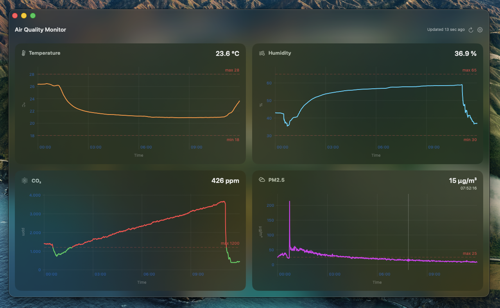
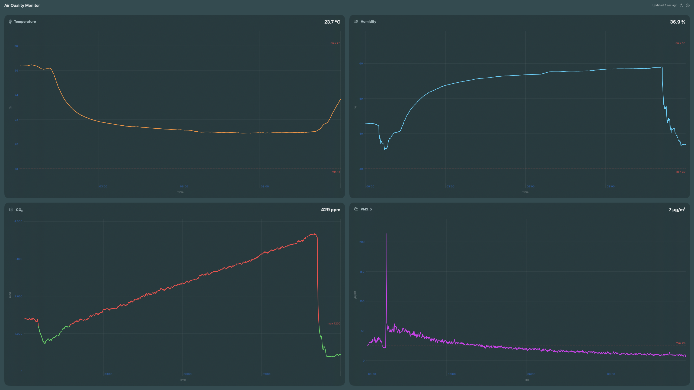
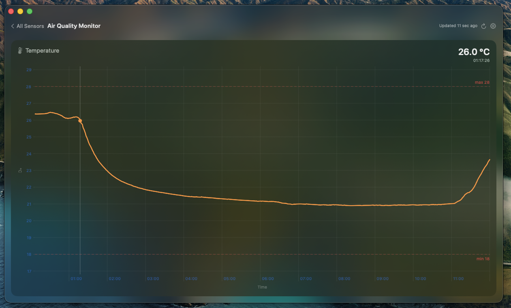
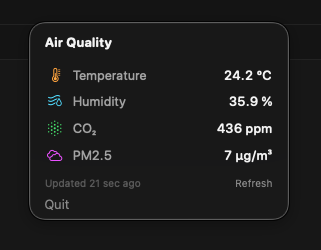

# Air Quality Monitor

A native macOS app that displays real-time air quality data from an **IKEA ALPSTUGA** sensor connected to **Home Assistant** via Matter over Thread.

Built with SwiftUI and Swift Charts. Runs as both a windowed app and a menu bar widget.



<details>
<summary>More screenshots</summary>

**Full-screen view**



**Expanded single chart**



**Menu bar widget**



</details>

## Features

- **Live charts** for Temperature, Humidity, CO2, PM2.5, and any other HA sensor with configurable history window
- **Categories & subcategories** — organize sensors by room or type with custom icons via a sidebar navigation
- **Threshold indicators** — lines turn red when values exceed safe ranges, with dashed boundary markers (toggleable)
- **Average line** — displays the calculated average for the visible time period on each chart (toggleable)
- **Smart outlier filtering** — filters isolated sensor glitches (e.g. PM2.5 spikes) while preserving sustained elevated readings
- **Interactive hover** — crosshair tooltip shows exact value and timestamp at cursor position
- **Click to expand** — click any chart to view it full-screen, click again to return
- **Grouped chart mode** — toggle between individual charts and combined charts grouped by unit
- **Menu bar widget** — configurable sensor reading in the menu bar with a popover showing all sensors
- **Threshold notifications** — macOS notifications when sensor values go out of range (with 5-minute cooldown)
- **Translucent glass UI** — macOS vibrancy effects for a native look
- **Portable config** — JSON configuration file, easy to copy between machines
- **Self-update** — check for and install updates from the app (git-based)

## Requirements

- **macOS 15.0** (Sequoia) or later
- **Home Assistant** with the sensor accessible via the REST API
- **IKEA ALPSTUGA** air quality sensor (or any HA sensor — entity IDs are configurable)
- **Long-lived access token** from Home Assistant

## Installation

### Build from source

```bash
git clone https://github.com/SirAntonySir/air-quality-monitor.git
cd air-quality-monitor
make install
```

This builds a release binary and copies `Air Quality Monitor.app` to `/Applications/`.

### Other commands

```bash
make build   # Build the .app bundle in build/
make run     # Build and open immediately
make clean   # Remove build artifacts
```

### Open in Xcode

Open `Package.swift` in Xcode to build and run from the IDE.

## Configuration

On first launch, the app opens the Settings window (also accessible via **Cmd+,** or the gear icon in the toolbar).

### Connection setup

1. Open **Settings > Connection**
2. Enter your Home Assistant URL (e.g., `http://192.168.178.120:8123`)
3. Paste a **long-lived access token** (create one in HA: *Profile > Security > Create Token*)
4. Click **Test Connection** to verify
5. Adjust display options (show/hide threshold lines and average line)
6. Click **Save**

### Config file

Settings are stored at:

```
~/.config/airquality-monitor/config.json
```

To set up on another machine, copy this file and update the URL/token. A template is also available at `config.example.json`.

### Sensor organization

Sensors can be organized into **categories** and **subcategories** (e.g., rooms) via **Settings > Sensors**. Each category and subcategory can have a custom name and SF Symbol icon. The sidebar only shows categories that contain sensors.

You can also drag sensors between categories using the context menu in the main view or the move button in Settings.

### Sensor configuration

The app ships with default entity IDs for the IKEA ALPSTUGA:

| Sensor | Default Entity ID | Thresholds |
|--------|-------------------|------------|
| Temperature | `sensor.alpstuga_air_quality_monitor_temperature` | 18–26 °C |
| Humidity | `sensor.alpstuga_air_quality_monitor_humidity` | 30–60 % |
| CO2 | `sensor.alpstuga_air_quality_monitor_carbon_dioxide` | max 1000 ppm |
| PM2.5 | `sensor.alpstuga_air_quality_monitor_pm2_5` | max 25 µg/m³ |

Entity IDs, thresholds, colors, and icons can be changed in **Settings > Sensors** or by editing `config.json` directly.

### Outlier filtering

For sensors prone to occasional glitches (e.g., PM2.5), enable `"filterOutliers": true` in the sensor config. The filter uses a rolling median window to detect isolated spikes and removes them, while preserving sustained elevated readings (3+ consecutive readings) that may represent real events like cooking or traffic.

### Using with other sensors

This app works with **any Home Assistant sensor**, not just the ALPSTUGA. Change the entity IDs in Settings to match your setup. You can also modify sensor names, units, icons, colors, and thresholds in the config file.

## How it works

```
┌─────────────────────────────────────┐
│  Air Quality Monitor (SwiftUI)      │
│                                     │
│  SensorViewModel ── HAClient ─────────── GET /api/history/period
│  (@Observable)      (async)         │     Home Assistant REST API
│       │                             │
│  ┌────┴──────────────────────┐      │
│  │ Sidebar (categories)      │      │
│  │ N× SensorChartView       │      │
│  │ (Swift Charts + hover)    │      │
│  └───────────────────────────┘      │
│                                     │
│  MenuBarExtra (always visible)      │
│  NotificationManager (alerts)       │
└─────────────────────────────────────┘
```

### Data flow

1. **On launch** — fetches the full history window (default 12h) from the HA REST API
2. **Every 30s** — polls the latest state for each sensor and appends to the in-memory array
3. **Every 15min** — re-fetches the full history to correct gaps and trim old data
4. **No local storage** — all data is fetched fresh from HA on every launch

### Threshold coloring

When a sensor value crosses a threshold boundary, the app interpolates the exact crossing point and splits the line into colored segments — green/blue/orange/purple within range, red outside. This gives clean, accurate color transitions at the boundary lines.

### Notifications

When a sensor value transitions from in-range to out-of-range (or vice versa), a macOS notification is sent. Notifications have a 5-minute cooldown per sensor to avoid spam. The initial state is seeded from history data so the first poll doesn't trigger false alerts.

## Project structure

```
├── Package.swift                        # Swift Package (macOS 15+)
├── Makefile                             # build / install / run / clean
├── Info.plist                           # .app bundle metadata
├── config.example.json                  # Config template
└── Sources/AirQualityMonitor/
    ├── AirQualityMonitorApp.swift        # App entry + MenuBarExtra + Settings scenes
    ├── Config.swift                      # AppConfig model, categories, ConfigLoader
    ├── Models.swift                      # SensorReading, TaggedPoint, outlier filter, threshold interpolation
    ├── HAClient.swift                    # Home Assistant REST API client
    ├── SensorViewModel.swift             # @Observable view model, polling logic
    ├── ContentView.swift                 # Sidebar, chart grid, expand/collapse, glass background
    ├── SensorChartView.swift             # Swift Charts with threshold coloring, average line, hover
    ├── MenuBarView.swift                 # Menu bar icon + popover
    ├── SettingsView.swift                # Preferences (connection, display, sensors, categories, about/updates)
    ├── NotificationManager.swift         # Threshold notifications with cooldown
    └── AppVersion.swift                  # Version constant + git-based update check
```

## About the IKEA ALPSTUGA

The ALPSTUGA is a Matter-over-Thread air quality sensor with a Sensirion SEN63C module. It measures temperature, humidity, CO2, and PM2.5 at ~30-second intervals.

To use it with Home Assistant, you need:
- A **Thread Border Router** (e.g., Apple HomePod, Amazon Echo 4th gen, or a dedicated one)
- **Matter Server** (Python Matter Server) connected to HA via the Matter integration
- The sensor commissioned to your Matter fabric

Home Assistant stores sensor history for 10 days by default, which this app queries via the REST API.

## License

MIT
